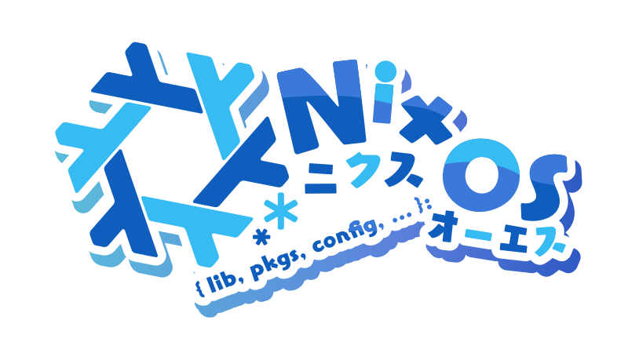

    
    <h1>The Snowflake</h1>
    

&nbsp;

A somewhat simple Nix Flake using [Niri](https://github.com/niri-wm/niri) and [Noctalia](https://github.com/noctalia-dev/noctalia) for two Snowleafies

## Hosts

### Fern Snowleafie
- **Aphrodite**: A HP Pro x360
- **Artemis**: A custom built desktop

### Lily Snowleafie
- **Athena**: A ThinkPad T440
- **Apollo**: A FrameWork 16

## Credits
This flake is largely inspired by the lovely works of:
- [uncenter/flake](https://github.com/uncenter/flake)
- [isabelroses/dotfiles](https://github.com/isabelroses/dotfiles)
- [raindropaurora.bsky.social/snowflake](https://tangled.org/raindropaurora.bsky.social/snowflake)
- [holly/fur](https://git.gay/holly/fur)

as well as many others in the nix community

## License

[Apache 2.0](LICENSE)
